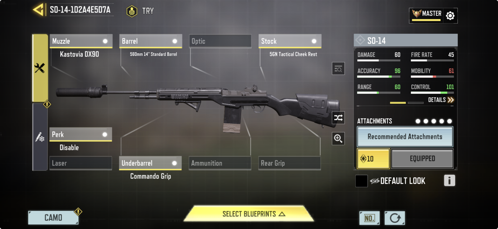
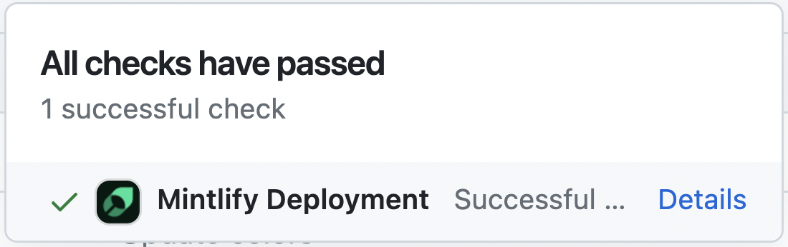

## Basic






### Inline Code

To denote a `word` or `phrase` as code, enclose it in backticks (`) new.

```
To denote a `word` or `phrase` as code, enclose it in backticks (`).
```

### Code Block

Use [fenced code blocks](https://www.markdownguide.org/extended-syntax/#fenced-code-blocks) by enclosing code in three backticks and follow the leading ticks with the programming language of your snippet to get syntax highlighting. Optionally, you can also write the name of your code after the programming language.

```java
class HelloWorld {
    public static void main(String[] args) {
        System.out.println("Hello, World!");
    }
}
```

```md
```java HelloWorld.java
class HelloWorld {
    public static void main(String[] args) {
        System.out.println("Hello, World!");
    }
}
```

```

```